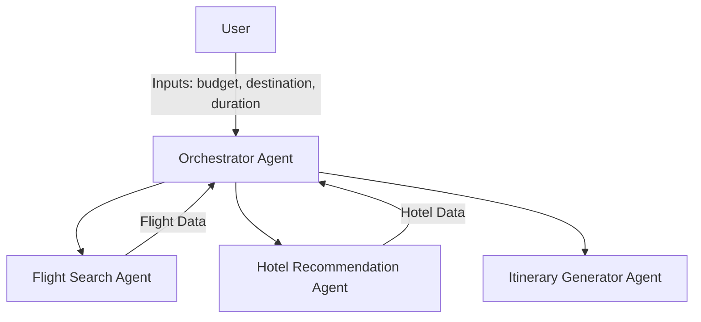

# VOYAGEAI_AGENT
VoyageAI – Your Personal Travel Concierge Agent  VoyageAI is a multi-agent, LLM-powered travel assistant that plans trips end-to-end based on user preferences. Enter your destination, budget, and travel dates — and VoyageAI will generate real-time flight options, hotel recommendations, and a personalized itinerary.

# VoyageAI – Multi-Agent Travel Concierge Assistant
VoyageAI is an AI-powered multi-agent concierge assistant that automates end-to-end travel planning. Designed for the **Concierge Agent Track** of the Google x Kaggle Generative AI Capstone Challenge, VoyageAI helps users plan personalized trips by generating flight options, hotel stays, and day-by-day itineraries based on user preferences.

# Problem
Travel planning is often overwhelming and time-consuming — comparing flights, finding reliable hotel options, and planning itineraries across multiple platforms takes hours. Most existing tools lack personalized AI-driven recommendations.

# Solution
VoyageAI solves this by using **LLM-powered multi-agent orchestration** to:

**Understand user preferences** (destination, budget, dates)
**Query real APIs** for flights, hotels, and attractions
**Generate a personalized itinerary** based on user interests and schedule
**Store session context** for personalization and continuity

##  Key Technical Features
**Multi-Agent System**  
Orchestrator Agent: Coordinates tasks
Flight, Hotel, and Itinerary Agents: Handle specialized subtasks
Powered by Google Gemini (or any LLM via API)
  
**External Tools Integration**  
  - REST APIs for flight, hotel, and POI search  
  - Rate limiting and error handling built-in

**Memory & State Management**  
  - Maintains session data for continuity  
  - Uses in-memory storage to retain preferences

**Observability**  
  - Logging for agent actions and response tracing  
  - Debug outputs for tool calls and context handling

# Architecture Diagram

## Project Showcase
Built as part of the Google x Kaggle Generative AI Capstone, VoyageAI demonstrates:
Multi-Agent Orchestration
Real-World Tool Usage (APIs)
LLM Reasoning and Task Delegation
Session State & Memory
This solution enhanced planning efficiency and would reduce travel research time by up to 80% for users.
voyageai/
├── agents/
│   ├── flight_agent.py
│   ├── hotel_agent.py
│   └── itinerary_agent.py
├── memory/
│   └── session_memory.py
├── utils/
│   ├── api_clients.py
│   └── logging.py
├── main.py
├── requirements.txt
└── README.md

## How to Run
1. **Clone the Repository**
   git clone https://github.com/YOUR_USERNAME/voyageai-travel-agent.git
   cd voyageai-travel-agent
   
2. **Install Dependencies**
   pip install -r requirements.txt
   
3. **Add Environment Variables**
   Create a .env file and add:
   OPENAI_API_KEY=your_openai_key_here
FLIGHT_API_KEY=your_flight_api_key_here
HOTEL_API_KEY=your_hotel_api_key_here
4. **Run the Agent**
   python main.py
## Example User Interaction

Enter your name: Priyanshu
What's your budget? $800
Duration: 5 days
start date: 20-07-2025
end date: 25-07-2025
Travel destination: Tokyo, Japan
Interests: Sightseeing, cultural landmarks

 Generating your travel itinerary...
 Flight options: [Top 3 with prices]
 Hotels: [Recommended with ratings]
 Itinerary: [Day-wise plan for your trip]

 ## Agent Features Used in Capstone Requirements
1.This project demonstrates at least three required concepts:
2.Multi-Agent System: Orchestrator + 3 specialized agents.
3.Custom Tools: Flight, hotel, and itinerary API fetchers.
4.Session & State Management: Maintains user preferences during session.
5.LLM Integration: Uses Google Gemini for query routing and itinerary generation.
6.Observability: Console logging for debugging agent flow.

## Value Proposition
 With VoyageAI, trip planning is reduced from hours to minutes. It's personalized, AI-enhanced, and scalable — making it ideal for modern travelers or travel agencies seeking automation.

 ## License
 ## MIT License. Free to use and customize.

  1. Created for the Google x Kaggle Generative AI Capstone Challenge 2025
  2. Build your own travel concierge with AI!

